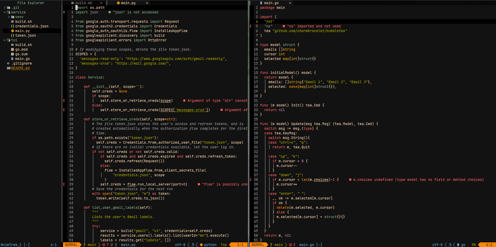
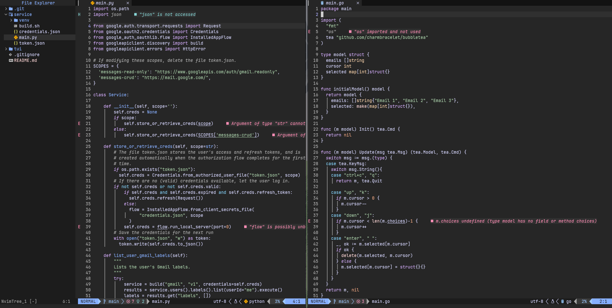
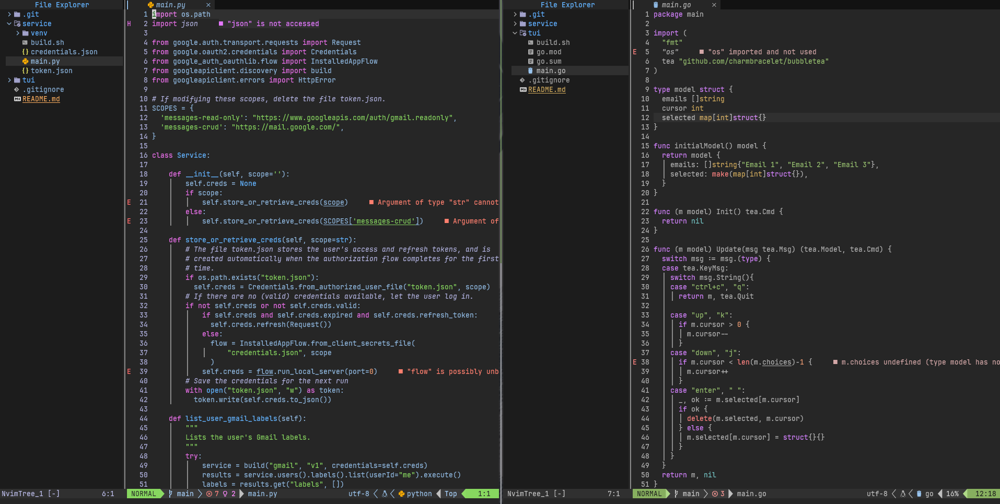
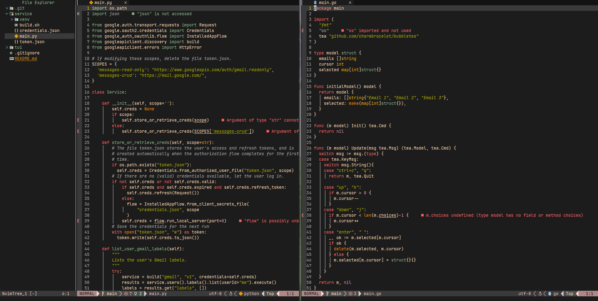

<h1 align="center">NV config</h1>

<div align="center">
 
[](https://github.com/neovim/neovim)
[](https://github.com/marcos-c1/nvim-config/issues)

</div>

<h2 align="center">Themes</h2>

<figure align="center">
    
    <figcaption style="text-align: center;">Moonbow theme</figcaption>
    
    <figcaption style="text-align: center;">Catppuccin theme</figcaption>
    
    <figcaption style="text-align: center;">Onedark theme</figcaption>
    
    <figcaption style="text-align: center;">Gruvbox theme</figcaption>
</figure>

## Only dependency

Needs neovim version > 0.9.0

## Throughts 

I was using vim script to configurate my entire nvim development environment but i started to look more about Lua script language and how it was implement, so i decide to learn more about the language. 

I frequently had problems with LSP in vim script because [coc](https://github.com/neoclide/coc.nvim) plugin, had to make an entire script just to make it work, in the new configuration with Lua, i dont have that kind of problem, was so simple to configurate all the way with the support of [mason](https://github.com/williamboman/mason.nvim). 

Lua basically works around tables structure, these tables implement all these abstractions found in others languages like arrays, records, lists and more. Maybe you would think "well, that can be a problem right?", no it isn't, surpresilly it removes all those complexity which isn't necessary in an script language (not for configuration purpose)

**TL;DR**: I'm fascinated by how Lua works and decide to take a step to implement this basic template configuration for neovim. Hope you guys liked it. 

## Overview
    
- This is just a simple template with tools that i use, you can change every plugin you want entirely. For me, has been useful with these plugins:

## List of plugins

- Plugin manager [Lazy](https://github.com/folke/lazy.nvim)
- Fuzzy finder over files & more [Telescope](https://github.com/nvim-telescope/telescope.nvim)
- Inbuilt terminal toggling & management [Nvterm](https://github.com/NvChad/nvterm)
- Git changes in code & more [Gitsigns](https://github.com/lewis6991/gitsigns.nvim)
- A snazzy built for manage files across tabs or buffers [Bufferline](https://github.com/akinsho/bufferline.nvim)
- A float terminal UI for git commands [Lazygit](https://github.com/jesseduffield/lazygit)
- Lualine statusline theme [Lualine](https://github.com/nvim-lualine/lualine.nvim)
- Moonbow colorscheme theme [Moonbow](https://github.com/arturgoms/moonbow.nvim)                              
- Catppuccin colorscheme theme (can integrate with Lualine)[Catppuccin](https://github.com/catppuccin/nvim)   
- Onedark colorscheme theme [Onedark](https://github.com/navarasu/onedark.nvim)
- Gruvbox colorscheme theme [Gruvbox](https://github.com/ellisonleao/gruvbox.nvim)
- A management tool for language server protocol LSP [Mason](https://github.com/williamboman/mason.nvim) 
- A tool to configure LSP for lazy [NvimConfig](https://github.com/neovim/nvim-lspconfig)
- File explorer with some functionalities [NvimTree](https://github.com/nvim-tree/nvim-tree.lua) 
- Syntax highlighter for your code [NvimTreeSitter](https://github.com/nvim-treesitter/nvim-treesitter)
- A beautifull stylish for icons [NvimWebDevIcons](https://github.com/nvim-tree/nvim-web-devicons)
- Useful functions for Lua [Plenary](https://github.com/nvim-lua/plenary.nvim)
- Popup with keybindings [WhichKey](https://github.com/folke/which-key.nvim)

## Keybinds syntax

To every plugin installed, you can manage your keybinds defining an attribute to the object using this kind of syntax: 

```lua
M.telescope = {
    plugin = true,
    ["<leader>ff"] = { "<cmd> Telescope find_files <CR>", "Find files" },
    ...
},
```
Where the attributes of the object can be plugin and the definition of the key. 

To see all the used keybinds, press enter in keyboard to display whichkey popup.

> Made with :gift_heart: by @marcos-c1 
